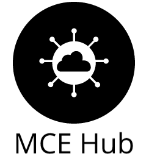

<p align="center">
  
</p>


# Un espacio para compartir

Ésta página fue creada con el propósito de compartir conocimiento entre personas interesadas en la ciencia de datos, la estadística y la programación.
Somos un grupo de estudiantes y graduados de la maestría en cómputo estadístico del CIMAT Monterrey, interesados en la Ciencia de Datos.

### Miembros de MCE Hub


```markdown
Castillo Casanova Román
Miranda Belmonte Hairo 
Uc Kantun Orlando de Jesus

...y muchos más!
```

### Próximos eventos relacionados

[II Congreso Internacional de Ciencias de la Computación y X Congreso Nacional de Ciencias de la Computación](https://conacic.siycise.org/)\
Del 9 al 13 de noviembre de 2020, Benemérita Universidad Autónoma de Puebla.

[XXI Congreso Internacional de Informática y Sistemas – CIIS 2020](https://www.ciistacna.com/2020/)\
Del 9 al 13 de noviembre de 2020, Universidad Nacional Jorge Basadre Grohmann, Tacná, Perú.

[14° Taller de Solución de Problemas Industriales](http://spi.eventos.cimat.mx/)\
Del 11 al 15 de enero de 2021, Centro de Investigación en Matemáticas.

[XX Escuela de Matemáticas](http://matmor.unam.mx/eventos/escuela2021/)\
Del 11 al 15 de enero de 2021, Centro de Ciencias Matemáticas, UNAM Campus Morelia.

### Eventos pasados

[Get Together: Friends of CIMAT, 40th Anniversary](http://friendsofcimat.eventos.cimat.mx/)\
Del 5 al 6 de noviembre de 2020, Centro de Investigación en Matemáticas, Unidad Monterrey.

[XVIII Escuela de Probabilidad y Estadística](http://epe2020.eventos.cimat.mx/)\
Del 2 al 4 de noviembre de 2020, Centro de Investigación en Matemáticas.

[Taller Mexicano en Ciencia de Datos y Big Data](http://tallercdbd.eventos.cimat.mx/node/1508/)\
Del 29 al 30 de octubre de 2020, Centro de Investigación en Matemáticas, Unidad Monterrey.

[Escuela de Modelación y Métodos Numéricos 2020: Supercómputo](http://modelacion2020.eventos.cimat.mx/)\
Del 28 al 30 de octubre de 2020, Centro de Investigación en Matemáticas.

[Escuela de Ciencia de Datos 2020](http://www.matcuer.unam.mx/cienciasdatos)\
Del 19 al 31 de octubre de 2020, Unidad Cuernavaca del Instituto de Matemáticas de la UNAM.

[Congreso Nacional Virtual de la Sociedad Matemática Mexicana 2020](https://www.smm.org.mx/congreso)\
Del 19 al 23 de octubre de 2020, Sociedad Matemática Mexicana.

[Hackaton BBVA 2020](https://openinnovation.bbva.com/es/evento/hackathon-bbva-2020)\
Del 16 al 18 de octubre de 2020, Banco BBVA.

[8° Seminario y 7a Escuela Nacional de Aprendizaje e Inteligencia Computacional](https://ccc.inaoep.mx/SNAIC/2020/index.html)\
Del 28 de septiembre al 2 de octubre de 2020, Instituto Nacional de Astrofísica, Óptica y Electrónica.

[XIII Foro de Matemáticas del Sureste](http://congresos.ujat.mx/foromatematicas/)\
Del 14 al 18 de septiembre de 2020, Universidad Juárez Autónoma de Tabasco.

[Coloquio Virtual AME 2020](https://www.coloquio.amestad.mx/)\
Del 10 al 11 de septiembre de 2020, Asociación Mexicana de Estadística.

[Escuela de Verano de Procesamiento de Lenguaje Natural 2020](https://ampln.github.io/escuelaverano2020)\
Del 2 al 4 de septiembre de 2020, Red Temática en Tecnologías del Lenguaje CONACYT y Asociación Mexicana de Procesamiento de Lenguaje Natural.

[DataJam Pasos Libres Online 2020](https://www.ibm.com/events/co/es/datajam/)\
Del 29 de agosto al 4 de septiembre de 2020, IBM y Fundación Pasos Libres.

[Bernoulli-IMS One World Symposium 2020](https://www.worldsymposium2020.org/home)\
Del 24 de agosto al 28 de agosto de 2020, Bernoulli Society for Mathematical Statistics and Probability, Institute of Mathematical Statistics y  One World Probability Project.


### Contacto

Si tienes una duda o comentario, por favor envíanos un correo a [hub.mce@gmail.com](https://www.gmail.com)
